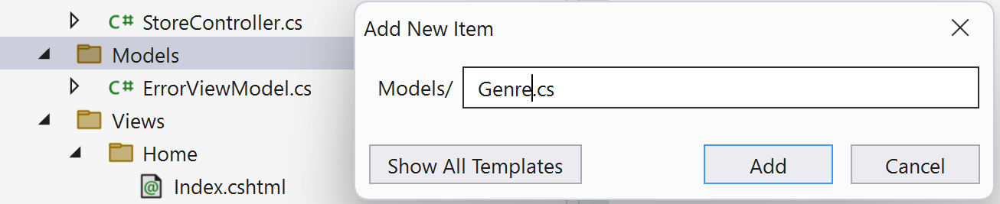

## Step 4 - Adding a Model

Now we can add a Model to help us retrieve data from our backend service. Guess it's time to get Copilot to help us again!

1. Select the `Models` folder in Solution Explorer.
2. Hit Ctrl+Shift+A to open the Add New Item dialog.
3. Give the new file the name `Genre.cs` as shown below.

  

  Your resulting C# class will look like this.

  ```csharp
  namespace CopilotMvcMusicStore.Models
  {
      public class Genre
      {
      }
  }
  ```
4. Use Copilot to add a new property called `Name` of type `string`.

5. Repeat these steps for a new Model class called `Album` that has two properties - `Title` of type `string` and `Genre` of type `Genre`.

### Wire up the Model to the Controller

Return to your `StoreController` and review the Details method which might look similar to this sample.

```csharp
public string Details(int id) { 
    return "Hello from Store.Details(), ID = " + id; 
}
```

Comment out or delete this method.

Let's use Copilot to replace this method with one that looks like this sample. Experiment with prompting to get as close as you can to this complete code in one go.

```csharp
public ActionResult Details(int id)
{
  var album = new Album { Title = "Album " + id };
  return View(album);
}
```

> [!NOTE]
> You will need to add some using statements before the solution will run.

At this point your `StoreController` class might like similar to this.

```csharp
using Microsoft.AspNetCore.Mvc;
using CopilotMvcMusicStore.Models;
using System.Web;

namespace CopilotMvcMusicStore.Controllers
{
    public class StoreController : Controller
    {
        // add three methods named Index Browse Details

        // add an Ilogger property to the StoreController class
        private readonly ILogger<StoreController> _logger;

        // pass an ILogger object to the StoreController constructor
        public StoreController(ILogger<StoreController> logger)
        {
            _logger = logger;
        }
        
        public string Index() { return "Hello from Store.Index()"; }

        public string Browse(string genre) { 
            // protect the genre input from JavaScript injection attacks
            string message = HttpUtility.HtmlEncode("Store.Browse, Genre = " + genre);
            return message; 
        }

        // a method called Details that returns ActionResult containing an Album object in a View
        public ActionResult Details(int id)
        {
            var album = new Album { Title = "Album " + id };
            return View(album); 
        }
    }
}
```

----

[Previous -  Adding a View](03-Step03.md)  | [Next - Modifying the Store Index](05-Step05.md)
