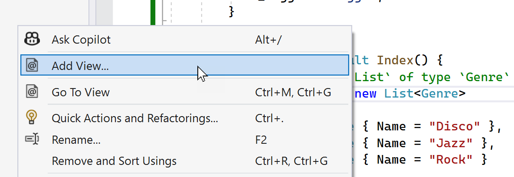

## Step 5 - Modifying the Store Index

Let's add some data to our Store Index page.

1. Open the `StoreController.cs` file in Visual Studio
2. Manually update the `Index` method to return a type of `ActionResult`
3. Use Copilot to create a .NET `List` of type `Genre` that has three entries - "Disco", "Jazz" and "Rock".
4. Return this new list in a View();

When you're finished your method might look something like. See if you can get Gopilot to generate the entire method with a single prompt.

```csharp
public ActionResult Index() {
    var genres = new List<Genre>
    {
      new Genre { Name = "Disco" },
      new Genre { Name = "Jazz" },
      new Genre { Name = "Rock" }
    };
    return View(genres);
}
```

We need to add a View to this method so our website can display the data correctly.

You can see if you can get Copilot to help you out as well if you'd like. It will recognise comments in CSHTML files and can use them as a prompt.

CSHTML comments are written like this.

```csharp
@* This is a comment *@
```

1. In the `Index` method, right-click and select `Add View...`

  

2. Select `Razor View - Empty` in the next dialog.
3. Save the file as `Index.cshtml`.
4. Manually add this model definition at the top of the file.

  ```csharp
  @model IEnumerable<CopilotMvcMusicStore.Models.Genre>
  @{
    ViewData["Title"] = "Store";
  }
  <h3>Browse Genres</h3>
  ```

Once you've made the changes, hit enter.

Wait for a few moments  and see if Copilot suggests something. Did it? If it looks like the code you want, hit tab to accept it.

Your resulting View might look something similar to the below.

```csharp
@model IEnumerable<CopilotMvcMusicStore.Models.Genre>
@{
    ViewData["Title"] = "Store";
}
<h3>Browse Genres</h3>
<ul>
	@foreach (var genre in Model)
	{
		<li>
			@Html.ActionLink(genre.Name, "Browse", new { genre = genre.Name })
		</li>
	}
</ul>
```

Next, we want to modify the `Details` page layout. Repeat the previous step to create an empty Razor View for the `Details` method. Name the file `Details.cshtml`.

Add this code to the top of the empty CSHTML file.

```csharp
@model CopilotMvcMusicStore.Models.Album
@{
	ViewData["Title"] = "Details";
}
<h2>Album: @Model.Title</h2>
```

Once you've made the changes, hit enter.

Wait for a few moments and see if Copilot suggests something. Did it? Were all the fields correct? Did you need to change anything?

Make any changes you need so the file is valid, then run the solution in debug mode and browse to the screen.

Finally, let's add a view for the Browse method. Repeat the above process, name the file `Browse.cshtml` and then paste the below code into the empty CSHTML file.

```csharp
@model CopilotMvcMusicStore.Models.Genre
@{
   ViewData["Title"] =  "Browse";
}
<h2>Browsing Genre: @Model.Name</h2>
```

See what Copilot suggests after you've entered this.

Re-run your application and browse to the Store page. Click on one of the genres and see if the page looks correct.

----

[Previous - Adding a Model](04-Step04.md)  | [Next - Adding a Data Source](06-Step06.md)