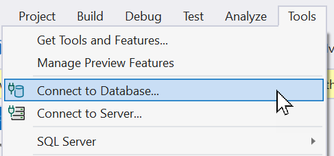
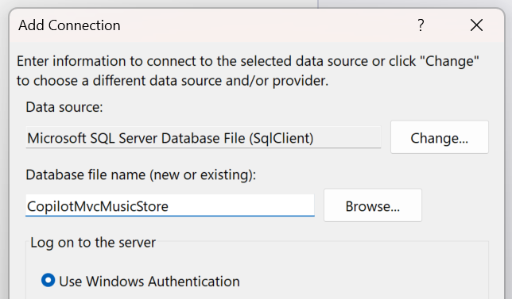
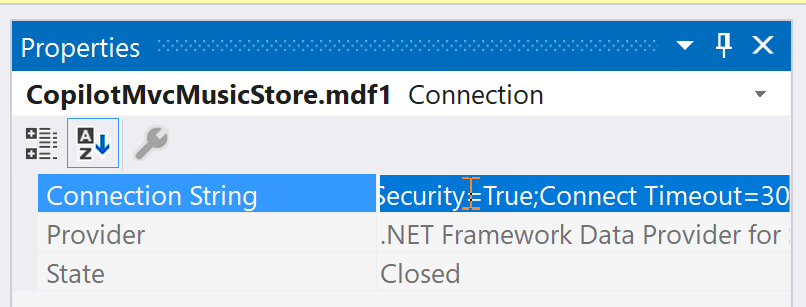

## Step 6 - Adding a Data Source

Now we've built out a bit of the web front-end ans now we need to add our datasource and wire it up to the application.

For this we are going to use Entity Framework Code First.

Let's first setup our database. Sadly, Copilot can't help us with this (yet) 😪.

1. In Visual Studio click on `Tools` and in the menu select `Connect to Database...`

  

2. Choose `Microsoft SQL Server Database File` on the dialog.

3. Browse to a location that is easy to find and has a relatively short path.

4. Enter the name `CopilotMvcMusicStore` in the Database file name field (it will be created for us). Select `Use Windows Authentication`.

  

4. Select On the confirmation dialog click `Yes`.

We now have a database we can use with our solution, but we need to configure a connection to it first. Leave the `Server Explorer` open.

1. Open the `appsettings.Development.json` file in your solution. Do you know how to configure a connection string? I don't always remember... guess what can help us?!

2. After the logging section write a Copilot prompt in a C# comment that will add a connection string to the localdb instance that uses your data file with Windows Integrated authentication.

Leave the generated connection string (whether it's right or not).

Return to your newly created database file in the `Server Explorer` in Visual Studio.

Select the database file you just created and right click on it and select `Properties`. In the Properties window select and copy the `Connection String` property.

  

Paste it into the `appSettings.Development.json` file and see how close it is to what Copilot inserted. Update the entry Copilot created with the actual connection string. 

While you're there, update the key to by `MusicStoreContext`. Your file should look similar to this sample.

```json
{
    "Logging": {
        "LogLevel": {
            "Default": "Information",
            "Microsoft.AspNetCore": "Warning"
        }
    },
    "ConnectionStrings": {
        "MusicStoreContext": "Data Source=(LocalDB)\\MSSQLLocalDB;AttachDbFilename=C:\\work\\CopilotLab\\MvCMusicStore\\MvCMusicStore\\Data\\CopilotMvcMusicStore.mdf;Integrated Security=True;Connect Timeout=30"
    }
}
```

----

[Previous - Modifying the Store Index](05-Step05.md)  | [Next - Adding Database Models and Seeding](07-Step07.md)
