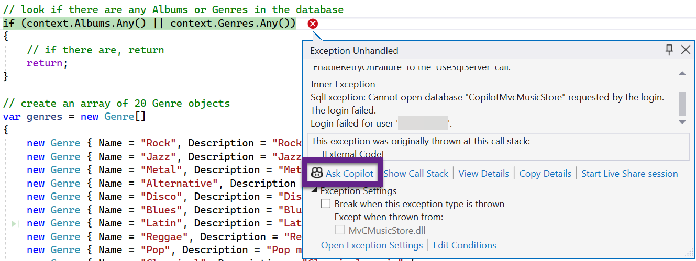
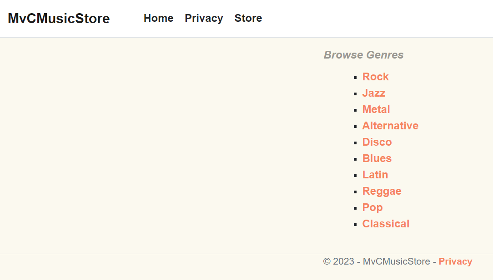

## Step 8 - Wire up database and display data

We need to wire up the database seeding routine for our web application. To do this we need to make some changes to the existing `Program.cs` file.

Open the file and add these using statements at the top.

```csharp
using Microsoft.EntityFrameworkCore;
using CopilotMvcMusicStore.Data;
```

Ask Copilot to add a DB context object that uses the connection string in your configuration file. Add it on the line after this one. Check that the connection string points to the right entry. If not, modify accordingly.

```csharp
var builder = WebApplication.CreateBuilder(args);
```

Next, get Copilot to generate the code to seed your database. Insert this new block of code after this line.

```csharp
var app = builder.Build();
```

Now, run your web application and see if your database is seeded. If you receive any errors, try using Copilot Chat (if you have it installed) to troubleshoot and fix. If you get stuck, ask your instructor for help.

  

Now we have a database let's wire it up to our web pages.

1. Open the `StoreController`.
2. Use Copilot to add a private readonly variable that will hold the database context object you created in the previous Step.
3. Update the Constructor to accept a context object that is assigned to the variable you just created. You will need to add a new Constructor, but don't forget to also still accept a logger object as well! Your resulting Constructor should look like this sample. Make sure to comment out or delete the existing Constructor.

    ```csharp
    public StoreController(ILogger<StoreController> logger, MusicStoreContext context
    {
        _logger = logger;
        _context = context;
    }
    ```

4. Use Copilot to update the `Index` method to render the list of `Genre` objects held in your database. The resulting method should look similar to this sample.

    ```csharp
    public ActionResult Index()
    {
        var genres = _context.Genres.ToList();
        return View(genres);
    }
    ```

5. Run the application and view the `Store` index page. It should look similar to the image shown below (your genre list might be different).

  

----

[Previous - Home](07-Step07.md)  | [Next - Updating Browse and Details Views](9-Step09.md)