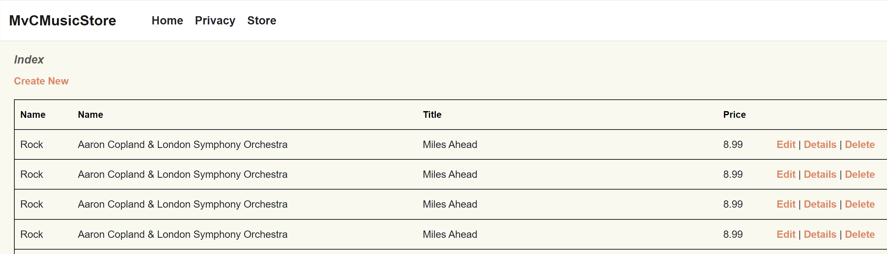

# Step 10 - Add CRUD Operations

So far we've built mostly 'view-only' pages for our application. Now it's time to build some Create Read Update Delete (CRUD) pages.

Add a new class in the `Controllers` folder called `StoreManagerController`. Manually set it to inherit from `Controller`.

Manually add these using statements to the top of the file.

```csharp
using Microsoft.AspNetCore.Mvc;
using Microsoft.AspNetCore.Mvc.Rendering;
using Microsoft.EntityFrameworkCore;
using Microsoft.VisualStudio.Web.CodeGenerators.Mvc.View;
using CopilotMvcMusicStore.Data;
using CopilotMvcMusicStore.Models;
```

In this new Controller use Copilot as follows:

1. Create an `Index` method that returns a View that contains all `Album` entities, including Artist and Genre (you did this in an earlier exercise).

2. Create a `Create` method that has no parameters and returns an empty View. The method should populate two ViewBag properties named `GenreId` and `ArtistId` which are assigned a new `SelectList` populated from the appropriate database table.

    ```csharp
    public ActionResult Create()
    {
        // add logic to create the album entity in the database
        ViewBag.GenreId = new SelectList(_context.Genres, "GenreId", "Name");
        ViewBag.ArtistId = new SelectList(_context.Artists, "ArtistId", "Name");
        return View();
    }
    ```

3. Create a `Create` method that accepts an Album object via HTTP Post. If ModelState is valid, write the Album to the database and redirect to the `Index` view, otherwise popupulate your two ViewBag properties. This time make sure that the `SelectList` selects the Genre and Artist based on the `Album` argument passed to the method. Return the View and include the `Album`. 

4. We need to create some views before we progress, so let's do that now.

5. Right-click in the `Index` method and create a new View named `Index.cshtml`. Use the same approach as in Step 5.

    ```csharp
    @model IEnumerable<CopilotMvcMusicStore.Models.Album>
    @{
        ViewData["Title"] = "Index";
    }
    <h2>Index</h2>
    ```

6. In the `Index.cshml` file use Copilot to add the following. If you tab and wait a while Copilot might do some magic...
    - A HTML paragraph containing an ActionLink that links to the `Create` method and has the title "Create New".
    - A HTML table with a header row containing the column titles "Title", "Genre", "Artist", "Price" and "Action".
    - A foreach loop that iterates over the Model and renders a table row for each Album. The table row should contain the Album Title, Genre Name, Artist Name and Price with three Action Links - "Details", "Edit" and "Delete".

7. In your `StoreController`, right-click in the `Create` method and create a new View named `Create.cshtml`. Select an empty view.

    ```csharp
    @model CopilotMvcMusicStore.Models.Album
    @{
        ViewData["Title"] = "Create";
    }
    <h2>Create</h2>

    @using (Html.BeginForm())
    {
        
    }
    ```
8. Use Copilot to add the following inside the `using` statement
    - A validation summary set to `true`
    - A HTML fiedset that provides an edit form for an `Album` entity, ensuring that the Genre and Artist are rendered as a drop-down lists.

9. Add a DIV with an ActionLink taking back to the index.

Now run your solution and open the URL /StoreManager. You should be presented with a table of Albums. The `Create New` link will take you to the page you just finished creating.

  

The challenge for you is to finish wiring up the `Edit`, `Details` and `Delete` methods and views. You can use the `Create` method as a template for the `Edit` method.

----

[Previous - Updating Browse and Details Views](09-Step09.md)  | [Next - Wrapping things up](finish.md)
